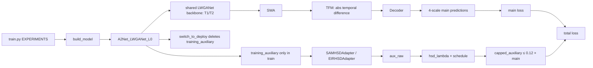

# Run2（EIR-HSD）薄弱点与下一步方法创新研究报告

> **审计日期**：2026-09-07  
> **目标**：面向可投稿的极轻量遥感二时相变化检测论文，对 Run2（EIR-HSD）进行代码—机制—结果—文献—实验闭环审计，并提出部署零额外成本的下一阶段方法主线。  
> **事实边界**：本文中的 Run2 数值全部来自**旧服务器归档正式 test block**，仅用于诊断机制与提出假设，**不是 RSML-3 当前正式测试结论**。RSML-3 的正式结论仍须从当前服务器同一 `train_log.txt` 中同时包含 `=== TEST RESULTS ===` 与 `=== END TEST RESULTS ===` 的最终 test block 获取。

## 0. 结论标签与证据等级

为避免把推断写成事实，全文使用以下标签：

- **[代码事实]**：由 GitHub `main` 当前 HEAD 或本次上传的脚本/源码快照直接证明。
- **[归档事实]**：由 `experiment_metrics.xlsx` 与 `models_and_metrics_SAM-HSD_Run2.txt` 中完整正式 test block 直接证明；仅代表旧服务器归档。
- **[文献事实]**：由正式论文页、CVF、IEEE/DOI、出版社页或作者官方仓库核验。
- **[推断]**：由上述证据进行的机制解释，不等于已通过新实验验证。
- **[研究假设]**：明确需要新增实验验证的下一阶段假设。
- **[待验证]**：当前材料不足，不能下结论。

---

# 1. 执行摘要

## 1.1 最关键发现

### A. R6“Fixed Fusion”不是一个真正的融合消融，而只是 R5 总辅助损失的整体乘 0.5 —— 严重级别：**High**

**[代码事实]** 当前 `EIRHSDAdapter` 中，R5 为

\[
L_{R5}=L_{enc}+L_{dec},
\]

R6 为

\[
L_{R6}=0.5L_{enc}+0.5L_{dec}=0.5L_{R5}.
\]

它没有改变 encoder 与 decoder 的**相对融合比例**，只是整体缩小一半。更关键的是，`train.py::capped_auxiliary()` 对 EIR-HSD 使用

\[
\widetilde L_{aux} = q\,\min\left(\frac{C}{\operatorname{sg}(q)+\epsilon},1\right),\quad
q=\lambda m(t)L_{aux},\quad C=0.12\,\operatorname{sg}(L_{main}).
\]

当 R5/R6 都进入 cap 区间时，R6 的 0.5 在前向尺度和 cap 反比例缩放中严格抵消。对底层 `L_enc/L_dec` 的梯度比例变成相同：

\[
\frac{\partial \widetilde L_{R5}}{\partial L}
=\frac{C}{\operatorname{sg}(L_{R5})},\qquad
\frac{\partial \widetilde L_{R6}}{\partial L}
=\frac{C}{\operatorname{sg}(L_{R5})}.
\]

因此 **R5–R6 只有在未触发 cap 的训练阶段才真正不同**。旧日志后期 R5/R6 多次接近或达到 `aux_ratio=0.12`，所以现有 R5–R6 差值不能被解释成“融合方式优劣”。这是当前最需要在论文前修复的消融语义问题。

### B. R5 的“Full EIR-HSD”在实际优化中被 residual correction 主导 —— 严重级别：**High**

**[归档事实]** 旧服务器 R5 日志后期可见：encoder 项约 `0.05`，decoder structure 约 `0.05`，relation 约 `0.01–0.02`，但 correction 常约 `3.5–4.5`；decoder 总量约 `1.8–2.3`。同时 correction 激活像素比例非常稀疏，例如尾段 `fn_correction≈0.0004`、`fp_correction≈0.0001` 量级。

**[代码事实]** `residual_correction_loss()` 用 `prediction.detach()` 只负责选择当前 FN/FP，但 BCE 仍对原 `prediction` 回传梯度；支持权重来自 GT 与 teacher trust，最终通过 `weighted_mean()` 按支持像素权重归一。于是**极少量被选择像素不会因为数量少而自然减小该项标量幅度**。

**[推断]** 当前 R5 的论文叙事若写成“结构码 + 关系蒸馏 + 残差修正协同”，会被日志反驳：优化方向更接近“teacher/GT 支持下的稀疏困难样本动态重加权”。它既削弱结构表征创新，也让 R5 与 R7 的因果归因失真。

### C. R7 不能干净归因“Residual Correction 的作用” —— 严重级别：**High**

**[代码事实]** R7 不仅关闭 correction，而且因此把 `aux_raw` 从 correction 主导的量级降到结构/关系项量级；外部 `hsd_lambda` 与 `hsd_max_ratio` 保持不变。

**[归档事实]** 旧日志中带 correction 的 R5/R8 后期常贴近 12% 主损失上限，而 R7 的 `aux_ratio` 明显更低。

**[推断]** R5–R7 同时改变了“机制是否存在”和“辅助梯度预算”，无法把差值单独归因于 correction。本问题需要一个**预算匹配对照**修复，但预算匹配只是实验公平控制，不能包装成论文创新。

### D. EIR 的“交换不变性”在 teacher code 和 encoder pair representation 层面基本成立，但创新表述仍偏弱 —— 严重级别：**Medium–High**

**[代码事实]** 默认 EIR teacher code 使用绝对差、交/并覆盖、对称质量权重等，A/B 交换不改变 `structural_code`、`trust_change`、`trust_stable`；encoder 中默认 pair representation 为 `abs(z2-z1)` 与 `z1*z2`，也严格交换不变。R8 才恢复有向残差。

**[代码事实]** 但部署主模型的 `TemporalFeatureFusionModule` 本身已经以 `abs(x1-x2)` 形成差分，因此**主部署输出定义天然面向无序二时相对**。

**[推断]** R2 的价值不能只写成“让变化检测具有交换不变性”；审稿人会问：主模型本就基本无序，新增 EIR 到底提供了什么新的可学习信息？更有力的方向应是：**把交换群下的偶（change/stable）与奇（direction/order）结构成分做严格分解，避免 R8 那种把方向信息混进同一结构码。**

### E. 旧服务器结果反而最支持“精炼 R2 结构表征”，不支持继续堆 correction

**[归档事实]** 相对 R0，R2 在两个数据集上的 F1 增益几乎一致：SYSU `+0.3059`，WHU `+0.3061`；IoU 分别 `+0.4408`、`+0.5458`。R4（decoder correction）在 SYSU F1 `+0.7749`，但 WHU `-1.0097`；R5 也不是任一数据集最佳：SYSU 最佳为 R1，WHU 最佳为 R2。

**[推断]** 单种子不能证明 R2 真正稳定，但它是当前最值得进行 3-seed 验证的**机制信号**：交换不变结构码可能具有跨数据集一致性，而 correction 具有明显域依赖。

## 1.2 首选下一阶段主线

### **Z2-SRD：Swap-Group Even/Odd Structural Residual Distillation（交换群偶/奇结构残差蒸馏）**

一句话贡献：**利用二时相交换群 \(\mathbb Z_2\) 的群投影，在训练期辅助分支中把 SAM2 结构变化分解为严格交换不变的“偶结构”与严格交换反变的“奇方向”两种不可约成分，分别蒸馏到共享学生特征，而部署时完整删除辅助分支。**

它不是“再加一个注意力”，也不是“改 loss 权重”。它直接解决 R2/R8 的核心矛盾：R2 丢弃方向信息，R8 把方向信息粗暴塞回同一 sigmoid 结构码后性能恶化；新方案显式将两类群表示分离。

## 1.3 立即行动项

1. **先修实验解释，不急着改性能模块**：把 R6 标为“global 0.5 scaling control”，不要再称固定融合；补一个真正改变 `enc:dec` 相对比例或采用分支独立预算的公平对照，仅用于因果分析。
2. 对现有 R5/R7 记录每步 `||∇_main||`、`||∇_enc||`、`||∇_dec||`、`||∇_correction||` 与 cap 命中率，验证“correction 主导”是否在全训练而非仅尾段成立。
3. 不再优先扩展 correction；以 R2 为最小祖先实现 Z2-SRD。
4. Stage 0 先增加“交换后**训练状态/BN buffer**一致性”测试；现有 smoke 更偏输出/损失瞬时一致性，尚不足以证明一整个 train-step 的状态轨迹严格交换不变。
5. RSML-3 正式结果出来后再决定论文最终主表；旧服务器数值只保留为机制诊断。

---

# 2. 证据范围与限制

## 2.1 GitHub HEAD

**[代码事实]** 本次实际读取到的 GitHub `main` HEAD：

- 仓库：[YuqiWang-code/LS-Rep_BCD](https://github.com/YuqiWang-code/LS-Rep_BCD)
- Commit SHA：[`b1f360a24e160f0f496a1e9399d54dce52120a98`](https://github.com/YuqiWang-code/LS-Rep_BCD/commit/b1f360a24e160f0f496a1e9399d54dce52120a98)
- 提交页面显示日期：2026-09-07；可访问页面未给出可可靠读取的精确时分秒，因此本文**不伪造提交时间**。
- 访问日期：2026-09-07。
- 该提交只改动 `AGENTS.md`（+13/-2），并把项目研究定位明确为“模型/方法创新优先，损失调参和工程重构不作为核心贡献”。

## 2.2 已读取材料

### 当前代码（GitHub HEAD）

已审查：

- [`models/a2net.py`](https://github.com/YuqiWang-code/LS-Rep_BCD/blob/b1f360a24e160f0f496a1e9399d54dce52120a98/models/a2net.py)
- [`models/backbone/lwganet.py`](https://github.com/YuqiWang-code/LS-Rep_BCD/blob/b1f360a24e160f0f496a1e9399d54dce52120a98/models/backbone/lwganet.py)
- [`models/decoder/a2net_decoder.py`](https://github.com/YuqiWang-code/LS-Rep_BCD/blob/b1f360a24e160f0f496a1e9399d54dce52120a98/models/decoder/a2net_decoder.py)
- [`models/distill/teacher_cache.py`](https://github.com/YuqiWang-code/LS-Rep_BCD/blob/b1f360a24e160f0f496a1e9399d54dce52120a98/models/distill/teacher_cache.py)
- `models/distill/sam_hsd/`：`relational_structure.py`、`temporal_evidence.py`、`encoder_hsd.py`、`decoder_hsd.py`、`losses.py`、`sam_hsd_adapter.py`
- [`models/losses/combined_loss.py`](https://github.com/YuqiWang-code/LS-Rep_BCD/blob/b1f360a24e160f0f496a1e9399d54dce52120a98/models/losses/combined_loss.py)
- [`models/scripts/train.py`](https://github.com/YuqiWang-code/LS-Rep_BCD/blob/b1f360a24e160f0f496a1e9399d54dce52120a98/models/scripts/train.py)
- `models/datasets/cd_dataset.py`、`transforms.py`、`cache_transforms.py`
- `models/tools/smoke_eir_hsd.py`
- `models/tools/sam/validate_teacher_cache.py`

### 用户上传的本地证据

- `Run2_all_shell_scripts.txt`：29 个 Run2 shell 的汇总快照。
- `experiment_metrics.xlsx`：已读取**全部工作表**：`Benchmark`、`Our Experiments`、`All Data`、`Run2 Summary`、`Run2 R5 Comparisons`、`Run2 Details`；重点复核后三个 Run2 sheet。
- `models_and_metrics_SAM-HSD_Run2.txt`：模型源码归档 + 18 组 Run2 旧服务器训练/测试日志。
- `参考文献_all.txt`：作为候选文献索引；重要文献均另行联网核验。

## 2.3 无法完整读取/独立核验的材料

1. **“项目中上传的最新版 AGENTS.md”没有作为单独附件出现在本次可检索上传文件中。**因此证据链采用：当前 ChatGPT 项目指令（最高优先级）+ GitHub HEAD 的 `AGENTS.md`。GitHub commit diff 已确认 2026-09-07 的研究定位更新。
2. GitHub `main` 当前公开文件树没有 `train_scripts/`，因此 `Run2(EIR-HSD)/README.md`、`run_experiment.sh`、R0–R8 shell 等**无法从 GitHub HEAD 独立核验**。shell 层以用户上传的 `Run2_all_shell_scripts.txt` 为直接证据。
3. `Run2(EIR-HSD)/README.md` 本体未上传，所以无法逐句比较 README 与代码；本文只对“项目指令摘要—上传 shell—当前代码”进行交叉核验。
4. RSML-3 当前训练日志未提供，因此本文不能判断当前服务器 R0–R8 的完成状态，也不报告其正式测试指标。

这些缺失不会影响本文最核心的代码发现（R6 等价缩放、R5 correction 主导、R7 预算混杂），但会限制“README 文案是否与代码完全一致”以及“RSML-3 当前矩阵是否完成”的结论。

---

# 3. R0–R8 真实机制与代码调用链

## 3.1 主调用链

**[代码事实]** `A2Net_LWGANet_L0._forward_main_path()` 始终是 backbone → NeighborFeatureAggregation(SWA) → TemporalFusionModule → Decoder；辅助分支只读取中间特征和预测，不把 teacher map 写回主特征流。`switch_to_deploy()` 直接删除 `training_auxiliary` 并将 `auxiliary_mode='none'`。

## 3.2 R0–R8 实际开关

| ID | `auxiliary_mode` | encoder | decoder | teacher evidence | spatial residual probe | correction | fusion | directional |
|---|---|---|---|---|---|---|---|---|
| R0 | none | — | — | — | — | — | — | — |
| R1 | sam_hsd | SAM-HSD encoder | SAM-HSD decoder | unsigned | Run1 原实现 | SAM-HSD 路由 | full | unsigned |
| R2 | eir_hsd | EIR encoder | off | exchange-invariant 4-code | **off** | off | — | off |
| R3 | eir_hsd | EIR encoder | off | exchange-invariant 4-code | **on** | off | — | off |
| R4 | eir_hsd | off | ResidualDecoderHSD | exchange-invariant 4-code | 参数不参与 encoder | **on** | — | off |
| R5 | eir_hsd | EIR encoder | ResidualDecoderHSD | exchange-invariant 4-code | on | on | `enc + dec` | off |
| R6 | eir_hsd | EIR encoder | ResidualDecoderHSD | exchange-invariant 4-code | on | on | `0.5enc+0.5dec` | off |
| R7 | eir_hsd | EIR encoder | ResidualDecoderHSD | exchange-invariant 4-code | on | **off** | `enc + dec` | off |
| R8 | eir_hsd | EIR encoder | ResidualDecoderHSD | first 3 code signed/centered | on | on | `enc + dec` | **on** |

### R0

**[代码事实]** 完全无 teacher cache、无 auxiliary。部署主图就是训练主图。

### R1

**[代码事实]** 对应 Run1 H6 语义：`mode='full'`、`evidence_mode='unsigned'`、`use_scgr=True`、`robust_filter=True`。它是 Run2 的旧方法参考，而不是 EIR 组成部分。

### R2：Exchange-Invariant Code

**[代码事实]** `ExchangeInvariantStructuralEvidence` 构造 4 通道：Boundary residual、Local relation residual、Geometry residual、Stable evidence；所有主要变化量为绝对差或对称组合。encoder 每层共享语义为

\[
z_1=P(f_1),\quad z_2=P(f_2),
\]
\[
r=|z_2-z_1|,\quad c=z_1\odot z_2,
\]

拼接后经过共享 head 预测 4-code。没有 decoder correction。

### R3：Spatial Residual Encoder

**[代码事实]** 唯一相对 R2 的机制变化是 `SpatialResidualProbe` 从单纯 1×1 投影变为

\[
P(f)+W_p\,\mathrm{GELU}(DW_{3\times3}(P(f))).
\]

因此 R2→R3 是当前 Run2 中相对干净的“局部空间残差适配”消融。

### R4：Residual Decoder Head

**[代码事实]** 关闭 encoder EIR，只在 decoder 四个 64-channel 层级上用共享训练期 `DecoderStructureHead` 预测 4-code，同时加入 GT-conditioned relation 和 residual correction。它不是“单纯 decoder 表征头”：correction 在实际损失中权重非常高。

### R5：Full EIR-HSD

**[代码事实]** R3 encoder + R4 decoder 直接求和；没有分支尺度归一化或动态融合。由于 decoder correction 数值量级远大于 encoder，所谓“full”并不是数值平衡的多层结构融合。

### R6：Fixed Fusion

**[代码事实]** 只是把 R5 全部 auxiliary 乘 0.5。见第 4 节高优先级问题。

### R7：No Residual Correction

**[代码事实]** 结构头和 relation 保留，correction 返回零。它同时大幅改变 auxiliary 标量/梯度预算，因此不是纯净因果消融。

### R8：Directional Restore

**[代码事实]** encoder `_pair_representation()` 改用有符号 `z2-z1`；teacher 前三个变化通道也改为方向编码，而 stable 通道仍不变。它把 odd（交换反变）信息与 even（交换不变）信息仍放在同一个 4-channel head/同一结构损失里。

---

# 4. 高优先级代码和实验有效性问题

## 4.1 P0：R6 的实验名与真实数学语义不一致

- **严重程度**：High / 论文因果解释有效性。
- **位置**：`models/distill/sam_hsd/sam_hsd_adapter.py::EIRHSDAdapter.forward`，`models/scripts/train.py::capped_auxiliary`。
- **影响实验**：R5、R6。
- **直接证据**：R6 = `0.5*(encoder+decoder)`，R5 = `encoder+decoder`。
- **指标解释影响**：R5-R6 不能用于证明“独立/动态融合优于固定融合”。cap 激活时两者梯度等价。
- **最小验证**：同一 batch、同一模型 state，分别计算 R5/R6；强制 cap 激活，比较所有学生参数 `grad_R5` 与 `grad_R6`，要求最大相对误差接近数值精度；再在 cap 未激活时验证 R6 梯度约为 R5 的 0.5。
- **最小修复**：论文层面先改名；若真要比较融合，应改变相对比例，例如 `αE+(1-α)D`，并确保两分支预算可比。该修复仅用于消融公平性，不是核心创新。

## 4.2 P0：R5/R7 的 correction 因果归因被辅助预算严重混杂

- **严重程度**：High。
- **位置**：`ResidualDecoderHSD.forward`、`residual_correction_loss`、`train.py::capped_auxiliary`。
- **影响实验**：R4/R5/R7/R8。
- **直接证据**：correction 存在时 raw decoder loss 远高于无 correction；外部 cap 固定为主损失 12%。
- **指标解释影响**：R5–R7 差值混合“是否 correction”和“辅助梯度总量/方向改变”。
- **最小验证**：记录每 100 step 的分支梯度范数、cosine、cap hit rate；另外做一个“无 correction、但通过**仅用于公平控制**的 detached 预算匹配使总 auxiliary gradient norm 与 R5 对齐”的对照。
- **剩余风险**：预算匹配本身若设计不当会引入第二个混杂，需只作为验证工具，不放入主方法。

## 4.3 P1：Sparse correction 被 `weighted_mean` 归一后可能产生不成比例的优化影响

- **严重程度**：Medium–High。
- **位置**：`models/distill/sam_hsd/losses.py::residual_correction_loss`、`weighted_mean`。
- **影响实验**：R4/R5/R6/R8。
- **代码事实**：FN/FP 选择 mask 使用当前预测 `detach()`；BCE 对 prediction 回传；分母按支持权重总和归一。
- **归档事实**：尾段 correction 支持比例可到万分之几，但 correction 标量仍约 3.5–4.5。
- **推断**：少量难例被赋予近似固定平均损失权重，导致该机制更像高杠杆 hard-example routing，而非“局部补偿”。
- **最小验证**：画 `support_mass`、`correction scalar`、`correction grad norm` 的散点；若 support_mass 下降而梯度不下降甚至上升，则假设成立。

## 4.4 P1：R8 没有真正验证“方向信息是否有价值”，只验证“把方向与不变量混在一起是否有价值”

- **严重程度**：Medium–High。
- **位置**：`temporal_evidence.py::ExchangeInvariantStructuralEvidence`、`encoder_hsd.py::ExchangeInvariantEncoderHSD`。
- **影响实验**：R8。
- **直接证据**：R8 把 signed residual 送进与 stable 共用的结构 head 与 loss；correction 仍占主导。
- **归档事实**：R8 相对 R0 在 SYSU F1 `-0.0433`、WHU `-0.5830`；相对 R5 两个数据集都更差。
- **正确解释**：不能据此宣称“方向信息无用”。只能说“当前混合式 directional restore 未显示收益”。
- **最小验证**：用新的偶/奇分解控制，保持 correction 关闭，单独比较 `even only`、`even+odd separated`、`mixed signed`。

## 4.5 P1：[待验证] 训练态严格交换不变性可能被 BatchNorm running buffer 的顺序更新破坏

- **严重程度**：Medium（尚未证明是实际 bug）。
- **位置**：`A2Net_LWGANet_L0.extract_pair_features()` 顺序调用共享 backbone：先 T1、再 T2；LWGANet/SWA/decoder 含 BN/SyncBN。
- **事实**：现有 smoke 已验证许多瞬时 swap 性质、主输出/auxiliary 一致性和 deploy 等价，但 `auxiliary_toggle_consistency()` 特意把 child module 置于 eval，只切 root training flag，因而不会测试真实训练时 BN running buffers 的交换轨迹。
- **推断**：对完全相同的初始 state，执行 `AB` 与 `BA` 两个真实 `model.train()` forward 后，running mean/var 的 EMA 更新顺序理论上可能不同。
- **最小验证**：clone 两份完全相同 state；一份 AB，一份 BA，同时交换 teacher pack；不 optimizer step，比较所有 BN buffers；再比较一次完整 backward 后的参数梯度。若 buffer/grad 差异不为零，再判断是否值得处理。
- **注意**：这不是当前已确认的结论有效性错误，不能在论文里写成 bug，除非 Stage 0 证实。

## 4.6 Teacher Cache replay 审计：目前未发现会直接推翻结论的错配

**[代码事实]** 数据增强顺序是 `Normalize -> Scale -> RandomCropResize -> RandomFlip -> RandomExchange -> ToTensor`。teacher cache 只重放几何/交换，不做 RGB normalize；`instance_id` 用 nearest，连续 boundary/quality 用 bilinear；exchange 最后交换 `t1/t2`。`prepare_relational_pack()` 在 replay **之后**构造 occupancy、affinity、interior depth、scale、compactness，因此关系结构与增强后几何一致。

**[代码事实]** validator 对所有训练 sample 做 schema/coverage 检查；校验 manifest 的 `source_dataset`、`config_hash`、样本集合，`TeacherCache.load()` 还校验 `sample_id` 与每文件 `config_hash`。

**结论**：当前证据支持 replay 设计基本正确，没有发现标签泄漏或明显 cache sample 错位。GT 被 residual correction/relation 显式用于训练监督，这属于**监督训练设计**，不是“teacher 偷看标签”；但论文文案必须准确写成“GT-confirmed teacher-supported correction”，不能写成纯 teacher 自纠错。

## 4.7 部署与恢复逻辑

**[代码事实]** 当前 `train.py` 硬校验：

- `EXPECTED_DEPLOY_PARAMS = 2_913_094`；
- `EXPECTED_DEPLOY_FLOPS = 2.7475e9`，并注明 RSML-3 THOP 当前约 `2.767634G`，容差 `0.03G`；
- `deploy_consistency()` 要求 max error `<1e-6`；
- `auxiliary_toggle_consistency()` 要求主输出完全不变；
- final test 前加载 validation-selected best checkpoint，再 `switch_to_deploy()`；
- 日志写入完整 `TEST RESULTS` 起止标记。

**[上传 shell 事实]** `common.sh` 只有在同一 `train_log.txt` 中同时检测到两个 test marker 才跳过；否则优先 `last_checkpoint.pth` 精确恢复，并拒绝只有 best checkpoint 而无 last checkpoint 的模糊恢复。

因此部署/最终测试主逻辑目前是 Run2 中较扎实的一部分，不应把研究精力主要消耗在工程重构上。

---

# 5. Run2 指标复核、消融归因和跨数据集分析

## 5.1 数据完整性

**[归档事实]** `models_and_metrics_SAM-HSD_Run2.txt` 中 R0–R8 × SYSU/WHU 共 18 组日志均找到了完整正式 test block；工作簿 `Run2 Details`/`Run2 Summary` 数值与这些 test block 对齐。工作簿 Run2 比较页是已写入数值，并非可依赖公式链；本文对差值进行了独立重算。

| 数据集 | 实验 | Recall | Precision | OA | F1 | IoU | Kappa |
|---|---:|---:|---:|---:|---:|---:|---:|
| SYSU | R0 | 78.4562 | 85.9354 | 91.8912 | 82.0257 | 69.5284 | 76.8044 |
| SYSU | R1 | 80.1666 | 85.7918 | 92.1917 | 82.8838 | 70.7706 | 77.8336 |
| SYSU | R2 | 79.5999 | 85.2575 | 91.9431 | 82.3316 | 69.9692 | 77.1213 |
| SYSU | R3 | 78.9978 | 85.4711 | 91.8803 | 82.1071 | 69.6455 | 76.8662 |
| SYSU | R4 | 80.8404 | 84.8582 | 92.0798 | 82.8006 | 70.6493 | 77.6599 |
| SYSU | R5 | 81.5131 | 83.9851 | 91.9746 | 82.7306 | 70.5475 | 77.5048 |
| SYSU | R6 | 77.8548 | 85.6822 | 91.7094 | 81.5811 | 68.8920 | 76.2478 |
| SYSU | R7 | 80.0754 | 85.6317 | 92.1326 | 82.7604 | 70.5908 | 77.6712 |
| SYSU | R8 | 78.5457 | 85.7336 | 91.8581 | 81.9824 | 69.4662 | 76.7362 |
| WHU | R0 | 92.2900 | 95.6469 | 99.5275 | 93.9385 | 88.5698 | 93.6927 |
| WHU | R1 | 91.4822 | 96.6042 | 99.5345 | 93.9735 | 88.6321 | 93.7316 |
| WHU | R2 | 93.3980 | 95.1066 | 99.5474 | 94.2446 | 89.1156 | 94.0091 |
| WHU | R3 | 92.2615 | 96.2347 | 99.5497 | 94.2062 | 89.0470 | 93.9721 |
| WHU | R4 | 91.9909 | 93.8861 | 99.4446 | 92.9288 | 86.7916 | 92.6398 |
| WHU | R5 | 91.6992 | 96.6565 | 99.5448 | 94.1126 | 88.8800 | 93.8761 |
| WHU | R6 | 91.9688 | 95.8800 | 99.5246 | 93.8837 | 88.4724 | 93.6364 |
| WHU | R7 | 91.8783 | 96.1406 | 99.5314 | 93.9612 | 88.6101 | 93.7176 |
| WHU | R8 | 91.2018 | 95.6134 | 99.4849 | 93.3555 | 87.5390 | 93.0878 |

## 5.2 相对 R0 的关键差值

| 实验 | SYSU ΔF1 | SYSU ΔIoU | SYSU ΔKappa | WHU ΔF1 | WHU ΔIoU | WHU ΔKappa |
|---|---:|---:|---:|---:|---:|---:|
| R1 | +0.8581 | +1.2422 | +1.0292 | +0.0350 | +0.0623 | +0.0389 |
| R2 | **+0.3059** | **+0.4408** | **+0.3169** | **+0.3061** | **+0.5458** | **+0.3164** |
| R3 | +0.0814 | +0.1171 | +0.0618 | +0.2677 | +0.4772 | +0.2794 |
| R4 | +0.7749 | +1.1209 | +0.8555 | **-1.0097** | **-1.7782** | **-1.0529** |
| R5 | +0.7049 | +1.0191 | +0.7004 | +0.1741 | +0.3102 | +0.1834 |
| R6 | -0.4446 | -0.6364 | -0.5566 | -0.0548 | -0.0974 | -0.0563 |
| R7 | +0.7347 | +1.0624 | +0.8668 | +0.0227 | +0.0403 | +0.0249 |
| R8 | -0.0433 | -0.0622 | -0.0682 | -0.5830 | -1.0308 | -0.6049 |

### 观察 1：R2 是跨数据集方向最一致的 EIR 设计

**[归档事实]** R2 对 R0 的 F1 增益在 SYSU/WHU 几乎相同（+0.3059/+0.3061），IoU/Kappa 同向。

**能支持**：R2 值得进入多种子验证。  
**不能支持**：单种子下不能宣称 R2 有统计显著的 +0.3 F1，也不能宣称其普适优于 R0。

### 观察 2：R4 显示强烈跨数据集反转

SYSU：Recall +2.3842、Precision -1.0772，F1 +0.7749；WHU：Recall -0.2991、Precision -1.7608，F1 -1.0097。

**[推断]** decoder correction 对错误分布、teacher coverage、类别比例或对象尺度高度敏感。它更像数据集相关的 error routing，而不是稳定的“结构先验”。

### 观察 3：R5 的 SYSU 收益主要是 Recall 换 Precision

相对 R0：SYSU Recall `+3.0569`，Precision `-1.9503`，F1 `+0.7049`。WHU 则 Recall `-0.5908`、Precision `+1.0096`、F1 `+0.1741`。

这说明同一 Full 机制在两个数据集上推动决策边界的方向不同。若论文只报 F1，会掩盖明显的 precision–recall trade-off。

### 观察 4：Full 并没有形成正组合效应

- SYSU：R1 F1 82.8838 > R7 82.7604 > R5 82.7306。
- WHU：R2 94.2446 > R3 94.2062 > R5 94.1126。

**[推断]** 当前 Full 不是“各组件协同优于单模块”的证据，反而提示负组合/梯度竞争。

## 5.3 R5 对 R6/R7/R8 的重新解释

| 比较 | SYSU ΔF1（R5-对照） | WHU ΔF1 | 旧表面解释 | 本审计解释 |
|---|---:|---:|---|---|
| R5-R6 | +1.1495 | +0.2289 | full 融合优于 fixed fusion | R6 只是全局 0.5 缩放；cap 时梯度可等价，不能证明融合 |
| R5-R7 | -0.0298 | +0.1514 | residual correction 略有益 | 同时改变 auxiliary budget；SYSU 甚至 R7 略高，因果不成立 |
| R5-R8 | +0.7482 | +0.7571 | exchange invariant 优于 directional | 只证明当前“混合式 signed restore”较差，不证明方向信息本身无用 |

## 5.4 最可能的 5 个失败机制与可证伪实验

1. **Correction 梯度垄断**  
   支持：日志 correction 量级远大于结构/encoder；cap 长时间饱和。  
   不支持：当前没有全程 per-branch gradient norm。  
   最小证伪：记录全程梯度范数与 cap hit rate；若 correction gradient 常不占主导，则推翻。

2. **R6 伪融合消融**  
   支持：数学上 R6=0.5R5；cap-active 梯度等价。  
   最小证伪：无；这是代码定义直接成立的事实。需要的是修复实验语义。

3. **Invariant 与 directional 信息被错误混合**  
   支持：R2 跨数据集同向，R8 两数据集均下降；R8 共享同一结构头。  
   不支持：没有 separated odd/even 对照。  
   最小证伪：Z2 分解后若仍不优于 mixed signed，则该解释被削弱。

4. **Spatial residual probe 的局部偏置在 SYSU/WHU 作用不同**  
   支持：R3 比 R2 在 SYSU 降、WHU 接近。  
   最小证伪：3 seeds + 分尺度 code error；若差异随机消失，则只是方差。

5. **训练态 BN 顺序破坏严格 swap-state symmetry**  
   支持：结构上存在顺序更新可能；现有 smoke 未覆盖真实 train buffer 轨迹。  
   不支持：没有观察到实际 buffer 差异。  
   最小证伪：Stage 0 clone-state AB/BA 一步测试。

---

# 6. 2024–2026 文献综述与“文献—代码—缺口”矩阵

## 6.1 文献结论先行

**[文献事实]** 2024–2026 已经出现多条与当前项目非常接近的路线：

- SAM/SAM2 直接进入变化检测推理图：SFCD-Net、SCD-SAM、SAM2-CD、ChangeSAM；这类工作与本项目**部署约束不同**。
- SAM 结构/边界作为监督信号：SAM-assisted segmentation、GoodSAM 等已证明“用 SAM mask/boundary 指导轻学生”本身不再新。
- **Burden-Free Distillation (BFD, TGRS 2025)** 已明确提出 foundation model 仅训练期使用、推理不增加负担，因此“teacher 训练期存在、部署删除”不能单独作为核心创新。
- 轻量 RSCD 方面 RFANet、BiFA、STRobustNet、SeCoR 等已经把“轻量 + 抑制 pseudo-change + 纠错/可靠性”做得很深入。特别是 **SeCoR (JSTARS 2026)** 已提出 evidence-guided selective correction，并有 5-seed 统计验证；因此继续把“selective correction”作为 Run2 新主线的审稿风险非常高。
- 2026 的 Compress-Align-Detect 已构造**temporal/permutation-invariant CD architecture**。因此简单说“交换不变网络”也不够新。

真正仍有差异化空间的是：**在不改变 A2Net 部署图的前提下，把 SAM2 单时相结构 teacher 变成一个具有明确群论约束的二时相训练期表示监督——尤其区分 swap-even 与 swap-odd 结构成分。**

## 6.2 核心文献（精读/方法核验）

| 文献 | 问题与核心机制 | 推理成本 | 与 EIR-HSD 相似点 | 实质差异 / 对本项目启示 |
|---|---|---|---|---|
| [FeaSpect, CVPR 2025](https://openaccess.thecvf.com/content/CVPR2025/html/Zang_Feature_Spectrum_Learning_for_Remote_Sensing_Change_Detection_CVPR_2025_paper.html) | 通过可学习 feature spectrum transformation 抑制成像风格 pseudo-change | 改变推理网络 | 针对二时相伪变化 | 说明 pseudo-change 应有明确物理/表征动机；EIR 不能只靠启发式 code |
| [GoodSAM, CVPR 2024](https://openaccess.thecvf.com/content/CVPR2024/html/Zhang_GoodSAM_Bridging_Domain_and_Capacity_Gaps_via_Segment_Anything_Model_CVPR_2024_paper.html) | SAM + teacher assistant，边界与多层知识适配到紧凑学生 | 学生可紧凑，但训练框架较复杂 | SAM 结构/边界指导轻学生 | “SAM mask/boundary → student”已被覆盖，必须突出二时相结构机制 |
| [MaskSub, CVPR 2025](https://openaccess.thecvf.com/content/CVPR2025/html/Heo_Masking_meets_Supervision_A_Strong_Learning_Alliance_CVPR_2025_paper.html) | 训练期 masked sub-branch，推理移除 | **零额外推理分支** | 训练期辅助、主干部署不增 | 证明 training-only branch 是成熟范式，但不是 CD-specific novelty |
| [BFD, TGRS 2025](https://doi.org/10.1109/TGRS.2025.3584094) | foundation model 双时相 feature matching + patch contrastive distillation；FM 推理删除 | **burden-free** | 与项目最接近的“FM only during training” | 本项目必须从“结构关系 + swap group”而非“无部署负担蒸馏”建立创新 |
| [SAM-assisted RS segmentation, TGRS 2024](https://doi.org/10.1109/TGRS.2024.3443420) | SAM-generated object consistency + boundary preservation loss | 不需 SAM 进入最终模型 | 使用 SAM object/boundary 作为监督 | 单时相 object/boundary 监督已非新；EIR 要体现跨时相关系 |
| [SCD-SAM, TGRS 2024](https://doi.org/10.1109/TGRS.2024.3407884) | MobileSAM + CNN 双 encoder 适配 semantic CD | SAM 相关模块在推理 | FM + CD | 与本项目硬约束相反；可作为“我们不把 SAM 带入部署”的对照 |
| [SFCD-Net, TGRS 2024](https://doi.org/10.1109/TGRS.2024.3483775) | SAM PEFT + bitemporal feature interaction + boundary loss | 增加推理结构 | SAM + 边界 + 二时相 | 进一步说明“SAM+feature interaction+boundary”组合已拥挤 |
| [SAM2-CD, JSTARS 2025](https://doi.org/10.1109/JSTARS.2025.3610156) | 直接适配 SAM2，activation selection 与跨时相局部差异建模 | SAM2 进入推理 | SAM2 + 二时相 | 本项目差异应是 offline structural teacher，不是 SAM2 backbone |
| [ChangeSAM, Pattern Recognition 2026](https://doi.org/10.1016/j.patcog.2026.114605) | SAM change adaptation、scene difference、local perception、dynamic calibration | 改变推理 | SAM + change-specific adaptation | 截至 2026-09-07 已有在线正式页面，期卷标为 2026-12；表明直接 SAM-CD 更拥挤 |
| [RFANet, ISPRS JPRS 2024](https://doi.org/10.1016/j.isprsjprs.2024.06.013) | 轻量多层特征强化、semantic split aggregation、channel interaction | 轻量推理 | 轻量 RSCD | 网络结构型创新成熟；本项目应避免再堆泛化模块 |
| [BiFA, TGRS 2024](https://doi.org/10.1109/TGRS.2024.3376673) | bitemporal channel/spatial alignment，抑制成像条件干扰 | 增加推理对齐 | 二时相关系 | 说明“时相对齐”已有专门工作，EIR 不应泛称 alignment |
| [ChangeMamba, TGRS 2024](https://doi.org/10.1109/TGRS.2024.3417253) | spatiotemporal state-space modeling | 改变推理 | 时空交互 | 属于强推理架构路线，不符合零部署新增成本 |
| [CDMamba, TGRS 2025](https://doi.org/10.1109/TGRS.2025.3545012) | local clue + Mamba global/local bitemporal fusion | 改变推理 | 变化局部/全局表征 | 不能通过“local residual module”与其争新颖性 |
| [STRobustNet, TGRS 2025](https://doi.org/10.1109/TGRS.2025.3540794) | spatial-temporal robust representations | 改变推理 | pseudo-change/稳健二时相特征 | “robust representation”表述过宽，需更数学化定义 |
| [SeCoR, JSTARS 2026](https://doi.org/10.1109/JSTARS.2026.3721954) | evidence-guided selective correction：encoder 可靠局部支持纠正 + decoder prototype-prior repair；5 seeds | 轻量但改变推理 | 与 R4/R5 correction 概念极近 | **强烈建议停止把 correction 作为核心创新方向** |
| [DepthCD, ISPRS JPRS 2025](https://doi.org/10.1016/j.isprsjprs.2025.05.020) | depth/height change prompt 缓解阴影、视角、光谱混淆 | 增加 depth/adapter 推理 | 借外部结构先验解释变化 | 启示：额外先验要与 CD 特有失败模式一一对应 |
| [Compress-Align-Detect, TGRS 2026](https://doi.org/10.1109/TGRS.2026.3686514) | onboard compression/alignment + temporally invariant permutation-equivariant CD | 改变推理架构 | 严格 temporal invariance | 简单 permutation invariance 已有；Z2-SRD 必须突出**训练期群投影蒸馏 + even/odd 分解** |
| [LWGANet, AAAI 2026](https://doi.org/10.1609/aaai.v40i9.37698) | RS 空间/通道冗余，异构 grouped attention；覆盖 CD | 当前 backbone | 学生 backbone | 当前学生已经有明确轻量 backbone 贡献，不应再把 backbone 小改当论文主创新 |
| [A2Net, TGRS 2023](https://doi.org/10.1109/TGRS.2023.3241436) | progressive feature aggregation + supervised attention 的轻量 CD | 当前主架构来源 | 直接基础 | 新方法必须保持主部署图定义可比较 |
| [Relation Changes Matter, TGRS 2023](https://doi.org/10.1109/TGRS.2023.3281711) | cross-temporal relation change + structure/contour consistency | 改变推理 | “关系变化”概念 | EIR 若只说 relation residual 会被认为延续已有思想，需要 teacher/group 机制差异 |

## 6.3 “文献机制—当前代码—未解决缺口”追踪矩阵

| 近期机制 | 已有代表文献 | 当前 Run2 对应 | 仍未解决的缺口 |
|---|---|---|---|
| FM 训练期蒸馏、推理去 teacher | BFD, MaskSub（通用范式） | 全部 HSD/EIR | **不是创新本身**；需解释传递的 CD-specific knowledge |
| SAM object/boundary supervision | GoodSAM, SAM-assisted TGRS | boundary/local/geometry code | 单时相结构已被覆盖；跨时相结构变换需要更强定义 |
| 严格时相/排列不变 | Compress-Align-Detect | R2 default EIR | 主部署 TFM 已 abs；“invariant”本身不够新 |
| selective correction/reliable support | SeCoR 2026 | R4/R5 correction | 近期工作过近，且当前 correction 存在归因/域稳定性问题 |
| robust pseudo-change modeling | FeaSpect, BiFA, STRobustNet | trust/stable code | 需要可解释的 nuisance/change factorization，而不是通用“robust” |
| relation change | CTD-Former 2023 | affinity/local/geometry residual | 需要 teacher-induced, group-structured relation representation 才有差异 |
| training-only overparameterization/reparam | MaskSub；更早 RepVGG 等 | switch_to_deploy 删除辅助 | 训练辅助删除已常见，不能单独贡献 |

---

# 7. 当前方法的学术薄弱点与审稿人可能质疑

1. **“EIR”名称大于实际机制。** 当前 invariant code 基本由若干绝对差、乘积、加权和构成；如果没有理论结构或更强实验证据，容易被评价为手工组合的 symmetric statistics。
2. **Full 不是最佳，且没有正组合效应。** 审稿人会直接问为什么单独 R2/R3/R1 比 full 更好。
3. **R6 消融定义不成立。** 这是方法论文中很危险的内部对照问题，必须在投稿前修复。
4. **correction 与 2026 SeCoR 过近。** 即使实现不同，关键词和核心直觉都非常相似，且 SeCoR 已有五种子统计证据。
5. **R8 的负结果没有把“方向价值”和“混合表示方式”分开。** 当前结论无法回答“二时相方向信息到底该丢弃还是隔离”。
6. **teacher structural code 的物理意义不够可辨识。** boundary/local/geometry 彼此相关，`structural_uncertainty` 只是这些通道间的启发式 disagreement；没有证明它们对应互补因素。
7. **GT 参与 relation/correction 后，teacher 的独立贡献被弱化。** 论文若宣传“SAM 纠错”会被追问：没有 GT-conditioned selection 是否仍有效？
8. **单种子旧结果没有方差。** +0.1～0.3 F1 不能当显著提升，尤其 WHU 已接近 94 F1。
9. **主模型已经 temporal-abs。** “exchange invariant”若只针对输出性质，新增训练辅助的必要性不足。
10. **缺少机制诊断量。** 当前日志虽然记录很多 scalar，但没有 per-branch gradient、swap leakage、结构码 calibration、按对象尺度/边界距离分层的性能，论证链没有闭环。

---

# 8. 候选创新方向、评分与严格淘汰

评分 1–5，`实现风险/实验成本`列分数越高表示风险/成本越低。

| 候选 | 核心贡献 | 新颖性 | 机制合理性 | Run2 契合 | 可证伪 | 零部署开销 | 实现风险 | 实验成本 | 论文叙事 | 结论 |
|---|---|---:|---:|---:|---:|---:|---:|---:|---:|---|
| **C1 Z2-SRD** | swap group even/odd 群投影结构蒸馏 | **4.7** | **5.0** | **5.0** | **5.0** | **5.0** | 4.2 | 4.2 | **5.0** | **首选** |
| C2 ITG-Distill | SAM instance birth/death/persist 转移图蒸馏 | 4.5 | 4.5 | 4.5 | 4.5 | 5.0 | 3.0 | 3.0 | 4.6 | 备选 1 |
| C3 MCER | support-mass calibrated evidence routing | 2.6 | 4.5 | 5.0 | 5.0 | 5.0 | 4.5 | 4.5 | 2.8 | 淘汰为主线；仅做公平控制 |
| C4 BNRT | boundary normal/signed-distance transport teacher | 4.0 | 4.3 | 4.1 | 4.5 | 5.0 | 3.4 | 3.5 | 4.2 | 备选 2 |
| C5 Swap-consistency-only | AB/BA consistency regularization | 2.5 | 4.0 | 4.5 | 5.0 | 5.0 | 4.8 | 4.5 | 3.0 | 淘汰：太接近已有 invariant CD，且主模型已 abs |
| C6 UDD | teacher disagreement 不确定性分解 | 3.1 | 4.0 | 4.3 | 4.0 | 5.0 | 3.8 | 4.0 | 3.5 | 淘汰：容易变成 confidence/weight 调参 |
| C7 Training reparam branch | 训练期结构过参数化后部署折叠/删除 | 2.7 | 4.0 | 3.5 | 4.0 | 5.0 | 3.2 | 3.5 | 3.4 | 淘汰：泛化重参数化文献成熟，CD 特异性弱 |

## 8.1 C1：Z2-SRD（首选）

详见第 9 节。它直接从 R2 的稳定信号和 R8 的失败出发，提出**可证明的群表示分解**，不是模块堆叠。

## 8.2 C2：Instance Transition Graph Distillation（备选 1）

**薄弱点**：当前 `instance_id` 只在每时相内部构造 affinity/shape，没有显式跨时相对象匹配。两个几何相似但身份不同的对象可能产生相近 residual statistics。

**机制**：在 replay 后对 T1/T2 SAM instances 构建二部图，使用 IoU、质心距离、面积/形状一致性与 quality 形成软匹配；得到 persistence / birth / death / split / merge teacher graph，再监督训练期 student relation probes。

**优点**：非常 CD-specific；不改 cache schema；部署删除。  
**风险**：缺少 SAM semantic embedding 时跨时相匹配可能过于启发式；若匹配规则复杂，会被质疑人为工程。

## 8.3 C4：Boundary-Normal Residual Transport（备选 2）

**薄弱点**：当前 boundary residual 只有边界强度差，无法区分“同一结构的小位移/配准误差”和“真正出现/消失的边界”。

**机制**：从 replay 后 SAM boundary 计算 signed distance field 与局部 normal，构造沿 normal 的近邻传输残差；小幅可解释 displacement 作为 nuisance，无法匹配的 topology break 作为 change evidence。

**优点**：直指遥感配准误差和边界伪变化；teacher-only。  
**风险**：需要稳定距离变换和局部匹配，且与 BiFA/对齐类工作的边界需明确。

## 8.4 明确淘汰方向

- **继续强化 residual correction**：与 SeCoR 2026 概念过近，当前数据又显示域反转；不适合作为主贡献。
- **只调 correction/support 权重**：属于 loss/超参数修补，不满足项目论文定位。
- **再加 attention/Mamba/decoder block**：会改变部署成本，也缺少与当前失败机制的因果连接。
- **仅做 AB/BA consistency loss**：主 TFM 已绝对差，且 temporally invariant CD 近期已有正式工作，增量性太强。
- **把 SAM2 feature/map 注入主推理路径**：违反当前 2,913,094 参数、2.75–2.77G FLOPs硬约束。
- **纯结构重参数化**：除非产生 CD-specific 新理论，否则属于成熟通用技巧，论文贡献弱。

---

# 9. 首选方案：Z2-SRD 完整方法设计

## 9.1 研究问题

二时相 BCD 的标签满足交换不变性：

\[
y(A,B)=y(B,A).
\]

但 teacher 的结构变化实际上包含两类信息：

1. **even / invariant**：变化幅度、关系断裂、稳定共现，交换 A/B 不变；
2. **odd / anti-equivariant**：从 T1→T2 的增加/减少方向，交换后应变号。

R2 只保留 even；R8 把 odd 信息压回同一个 4-channel sigmoid code。**研究假设 H：R8 失败的原因不是方向信息本身无用，而是 even/odd 两类不同群表示被错误混合；若做严格群投影分解，odd 可作为解释方向/扰动的辅助子空间，而不会污染 invariant change representation。**

## 9.2 群投影

令交换群 \(G=\mathbb Z_2=\{e,s\}\)，\(s(A,B)=(B,A)\)。对每个 encoder stage：

\[
z_1=P_k(f_1^k),\quad z_2=P_k(f_2^k).
\]

构造一个训练期共享 pair encoder \(\psi\)：

\[
u_{12}=\psi([z_1,z_2,z_2-z_1,z_1\odot z_2]),
\]
\[
u_{21}=\psi([z_2,z_1,z_1-z_2,z_1\odot z_2]).
\]

做群投影：

\[
h^+ = \frac{u_{12}+u_{21}}{2},\qquad
h^- = \frac{u_{12}-u_{21}}{2}.
\]

于是严格有：

\[
h^+(B,A)=h^+(A,B),\qquad h^-(B,A)=-h^-(A,B).
\]

这不是“靠数据增强学出来”的近似性质，而是结构上保证。

## 9.3 Teacher even/odd code

复用现有 cache，不重建。

### Even teacher \(T^+\)

直接使用 R2 的 4-channel exchange-invariant structural code：

\[
T^+=[B_{res},L_{res},G_{res},S_{stable}].
\]

### Odd teacher \(T^-\)

从 `temporal_evidence.py` 中现有 signed residual 中暴露原始中心化方向量，不再编码到 `[0,1]` sigmoid 概率：

\[
T^-=[\Delta B,\Delta L,\Delta G]\in[-1,1]^3,
\]

交换后满足 \(T^-(B,A)=-T^-(A,B)\)。stable 不应进入 odd 分支。

## 9.4 两个训练期 head

\[
\hat T^+=\sigma(H^+(h^+)),\qquad
\hat T^-=\tanh(H^-(h^-)).
\]

其中 `H+` 预测 4 通道，`H-` 预测 3 通道。

总辅助目标：

\[
L_{Z2}=\sum_k w_k\left(L_{even}^k + \beta L_{odd}^k\right).
\]

这里 \(\beta\) 只作为固定的训练稳定控制，不应被包装成创新；首轮建议固定为 1，并通过**分支独立归一化/预算诊断**确保不是量级问题。核心创新是群投影结构，不是 \(\beta\)。

### 可选但不作为首发核心的诊断项

记录 pooled `h+` 与 `h-` 的 cross-covariance，仅用于判断 leakage；除非 Stage 1 明确显示需要，否则**不要一开始就再加 decorrelation loss**，避免方法膨胀。

## 9.5 为什么是变化检测特异机制

- BCD 的标签对 A/B 交换天然不变，但真实世界 temporal transition 有方向；这是二时相任务特有的群结构。
- SAM2 cache 是**两个单时相结构观察**，天然可形成 even/odd cross-temporal residual。
- 目标不是一般网络 regularization，而是明确解决“无序 change label 与有序 temporal structure 共存”的矛盾。
- 主部署 TFM 已使用绝对差，因此 odd 信息最合适的角色是**训练期解释/分解辅助**，而不是进入部署 change head。

## 9.6 与近期工作的实质差异

- 对 BFD：BFD 做 FM feature matching/patch contrast；Z2-SRD 蒸馏的是 SAM2 结构 teacher 在交换群下的不可约分量。
- 对 GoodSAM/SAM-assisted：它们使用 object/boundary supervision，但没有二时相 swap group decomposition。
- 对 Compress-Align-Detect：其 temporal invariance 是**推理架构性质**；Z2-SRD 保持原 A2Net 部署图，用训练辅助分解 even/odd teacher knowledge。
- 对 SeCoR：Z2-SRD 不做 selective correction，不依赖 current prediction FN/FP routing。
- 对 R8：R8 把 signed 信息混在共享 4-code；Z2-SRD 用显式 \(+/-\) 群投影和不同输出域（sigmoid/tanh）隔离。

## 9.7 实现落点

### `models/distill/sam_hsd/temporal_evidence.py`

- 在 `ExchangeInvariantStructuralEvidence.forward()` 中保留现有 `structural_code`；
- 额外输出 `signed_structural_code`（3 通道，中心化 signed residual）；
- 保证默认 R0–R8 行为不变，新增实验才读取新 key。

### `models/distill/sam_hsd/encoder_hsd.py`

新增：

- `Z2PairProjector`
- `Z2StructuralEncoderHSD`

建议每 stage 仍先 1×1 `channel -> 16`，不先加入 spatial residual；因为旧归档 R2 比 R3 的跨数据集一致性更强。

### `models/distill/sam_hsd/sam_hsd_adapter.py`

新增新模式（建议新实验族 `N0/N1...`，不要篡改 R0–R8 语义）。首选主线为 encoder-only，不带 residual correction。

### `models/scripts/train.py`

新增新 experiment recipe；沿用 batch=64、40k、Adam、lr=5e-4、wd=1e-4、seed 规则和原 `hsd_lambda/max_ratio` 作为公平协议。不要为新方法单独调训练超参。

### `models/tools/smoke_eir_hsd.py`

新增：

- exact even invariance；
- exact odd anti-equivariance；
- signed teacher swap；
- even/odd head 非零梯度；
- backbone gradient；
- deploy 2,913,094 / error <1e-6；
- train-mode BN buffer swap-state test。

## 9.8 参数量/FLOPs

**部署**：完全不变，仍必须为 **2,913,094**，THOP 256² 约 2.75–2.77G。

**训练辅助参数设计估算**：若四层 probe 沿用 `channel -> 16`（共 7,680 参数），共享 pair projector `64 -> 16` + bias（1,040），even head `16->4`（68），odd head `16->3`（51），新增辅助共约 **8,839** 参数，训练总参数设计估算约 **2,921,933**。这是**未实现前的结构算术估算，不是当前代码事实**；实现后必须以实际 `sum(parameter.numel())` 为准。

无需第二次 backbone forward：`u12/u21` 只对已存在的 16-channel probe feature 做两次极小 1×1 映射，因此训练额外成本有限。

## 9.9 可证伪假设

- **H1**：Z2-SRD 的 even code error 在 AB/BA 完全相同，odd code 交换后严格反号；否则实现错误。
- **H2**：相对 R2，加入 separated odd 不应造成两个数据集同时下降；若下降，说明方向信息即便隔离后也无益。
- **H3**：Z2-SRD 相对 R8 应显著降低 “signed/mixed” 的负效应；若无差异，则“混合导致失败”假设不成立。
- **H4**：收益应首先出现在 boundary/geometry hard cases、Recall/Precision 平衡或跨数据集一致性，而不是只在一个数据集整体 F1 上偶然提高。

---

# 10. 分阶段实验矩阵、双 GPU 调度与继续/停止规则

## 10.1 Stage 0：不完整训练的正确性验证

必须全部通过后才允许正式跑：

1. tensor shape / dtype / finite；
2. \(\max|h^+_{AB}-h^+_{BA}|<10^{-6}\)；
3. \(\max|h^-_{AB}+h^-_{BA}|<10^{-6}\)；
4. teacher even invariant / odd anti-equivariant；
5. even head、odd head、四层 probes、backbone 均收到非零合理梯度；
6. 强制 crop/resize/hflip/vflip/exchange 后 cache replay 与学生几何一致；
7. train-mode AB/BA clone-state buffer/gradient 检查；
8. auxiliary on/off 主输出定义不变；
9. `switch_to_deploy()` 后参数 2,913,094、主预测误差 <1e-6、FLOPs 在 2.75–2.77G 容差内；
10. 8–16 个训练样本极小过拟合：main loss 与 even/odd code error 均可明显下降，无 NaN/梯度爆炸。

## 10.2 Stage 1：最小成本机制筛选

建议每个候选 **12k steps、seed 2333、SYSU+WHU**，训练协议除总步数外完全一致；所有候选用同一预算。

| ID | 研究问题 | 相对基线唯一变化 | 训练期辅助参数 | 部署参数 | 数据集 | seed | 主诊断 | 成功标准 | 失败决策 |
|---|---|---|---:|---:|---|---:|---|---|---|
| S1-R2 | 当前 invariant 参考 | 现有 R2 | +8,276（当前代码事实） | 2,913,094 | SYSU/WHU | 2333 | F1/IoU/Kappa + code error | 作为参照 | — |
| S1-Even | 群投影本身是否优于手工 abs/product | Z2 projector，仅 even head | 约 +8.8k（实现后实测） | 2,913,094 | SYSU/WHU | 2333 | swap leakage、F1 | 两数据集平均不劣于 R2，且 exact symmetry | 不满足则停止 Z2 projector |
| S1-Z2 | separated odd 是否带来互补 | 在 S1-Even 加 odd head | 约 +8.8k | 2,913,094 | SYSU/WHU | 2333 | F1/IoU/Kappa、P/R、odd error | 相对 R2：两数据集平均 ΔF1≥+0.20，任一不低于 -0.15；或指标相近但 P/R balance/边界诊断明确改善 | 两数据集均下降 ≥0.20 → 回滚 |
| S1-Mix | 验证“混合 signed 是失败原因” | 同 teacher signed，但复现 R8 式单 head 混合 | 与 S1-Z2 同量级 | 2,913,094 | SYSU/WHU | 2333 | 与 S1-Z2 对比 | Z2 > Mix 且方向一致 | 若相同，则弱化主假设 |

Stage 1 不用于论文最终性能主张；只决定是否值得跑 40k。

## 10.3 Stage 2：完整公平对比

40k、batch64、seed2333、相同 optimizer/schedule/pretrain/cache：

- R0 Clean Anchor
- R1 Run1 Unsigned Reference
- R2 Exchange-Invariant Code
- R5 原 Full EIR-HSD
- **N0 Z2-SRD**

如果 RSML-3 已经存在这些旧对照的**同代码、同协议、完整 test block**，无需重复训练；只补新方法，避免浪费算力。

Stage 2 进入下一阶段的门槛：

- 相对 R2/R5 至少一个主要对照，两个数据集的 F1/IoU/Kappa 总体同向；
- 平均 ΔF1 ≥ +0.25 或平均 ΔIoU ≥ +0.35，且单数据集 F1 不下降超过 0.15；
- 不允许通过 Recall 大涨、Precision 大跌形成不可解释的偏置；若 P/R 单侧变化 >1.5pp，应给出对应错误类型减少的定性证据；
- deploy 全部硬约束通过。

## 10.4 Stage 3：论文级消融与稳健性

最小充分配置：

1. **多种子主对比**：R2 vs Z2-SRD，SYSU/WHU，各 3 seeds（建议 2333、3407、5871）→ 12 runs。
2. **机制消融**（seed2333 即可）：
   - even only；
   - even+odd separated（full）；
   - mixed signed；
   - no group projection（回到 abs/product）；
   在 SYSU/WHU 共 8 runs。
3. 若主对比有稳定收益，再补 R0/R5 多种子作为论文主表；不要一开始把所有旧模块都跑 3 seeds。
4. 报告 mean±std；建议同时报告每 seed paired difference，不只均值。
5. 定性：边界错位、建筑增/减、小目标、同形异物、阴影/季节变化四类病例；同时展示 teacher even/odd code 与 student response。

## 10.5 双 RTX 5090 调度

为最大化可比性而非追求复杂调度：

- **GPU 0：SYSU 队列**；**GPU 1：WHU 队列**。
- 每个 Stage 按同一实验顺序成对启动，例如 `R2 -> Even -> Z2 -> Mix`，这样两个数据集几乎同步得到决策信号。
- Stage 3 种子按 `2333 -> 3407 -> 5871` 同顺序串行，各 GPU 固定一个数据集，可减少跨设备/环境变量。
- 预计新增运行数：Stage1 8 个短跑；Stage2 最多 10 个完整跑（已有 RSML-3 正式对照可复用则显著减少）；Stage3 核心约 20 个完整跑。优先级：Stage0 > Stage1 > Stage2 > 主方法多种子 > 机制消融 > 备选方案。

## 10.6 继续/停止规则

### 继续 Z2-SRD

- Stage0 所有对称/部署硬约束通过；
- Stage1 两数据集方向至少不冲突；
- Stage2 相对 R2/R5 跨数据集同向，F1/IoU/Kappa 至少三者一致；
- Stage3 3 seeds 的 paired mean 正，且标准差未吞没全部收益。

### 回滚到 R2

- separated odd 在两个数据集都稳定降低 F1/IoU；
- mixed 与 separated 无显著差异，无法支持 even/odd 分解叙事；
- odd branch 的主要作用只表现为改变 auxiliary gradient 量级，而无机制诊断改善。

### 转备选 C2

若 R2 仍稳定但 Z2 odd 无价值，说明“交换不变结构”方向成立但“方向分解”不成立；此时转向 **instance transition graph**，继续挖掘跨时相对象关系，而不是回到 correction。

### 转备选 C4

若失败主要集中在配准/边界错位样本，且 R2 的 geometry/boundary code error 与误检显著相关，则转向 boundary-normal transport。

---

# 11. 风险、负结果解释与备选路线

## 11.1 主要风险

1. **Z2 分解理论正确但性能无增益**：主 TFM 已 abs，学生可能已经自然学到足够 invariance。
2. **odd teacher 噪声大**：SAM 单时相 instance 没有语义对应，signed residual 可能更多反映实例划分抖动。
3. **群投影增加训练约束冲突**：even/odd 都回传 backbone，可能提高梯度冲突。
4. **+0.2～0.3 F1 处于随机方差范围**：必须依赖 3 seeds，不能用单次最好值。
5. **2026 文献继续快速出现**：投稿前需再次做一轮最新检索，尤其关键词 `temporal invariant / permutation equivariant / SAM distillation / change detection`。

## 11.2 负结果也可产生结论

- 若 even-only > even+odd：说明 BCD 任务最优 teacher 是严格 quotient/invariant representation，方向应被丢弃；这可反过来强化“方向是 nuisance”的结论，但需要 3 seeds。
- 若 Z2-SRD≈R2：说明 R2 的手工 abs/product 已足够近似群投影；不应硬包装新方法，应停止。
- 若 C2 instance graph 有益：可将论文主问题改为“foundation model 单时相实例结构如何转成跨时相 object transition supervision”。
- 若所有 teacher 辅助都不稳：应诚实考虑论文主线回到纯轻量学生结构，而不是继续堆训练损失。

---

# 12. 下一步行动清单（按优先级）

1. **P0：修正 R6 实验语义**，在文档/论文草稿中停止称其“fixed fusion”；补 cap-active 梯度等价单元测试。
2. **P0：为 R5/R7 加 per-branch gradient norm + cap hit rate 诊断**，先确认 correction 主导的全程程度。
3. **P0：读取 RSML-3 当前真实日志**，只从正式 test block 建当前结果表；旧归档表永久标为 archival。
4. **P1：实现 Stage0 的真实 train-mode swap-state/BN buffer 测试**。
5. **P1：以 R2 为祖先实现 `Z2PairProjector + even/odd heads`**；不动主部署图，不引入 decoder correction。
6. **P1：扩展 smoke_eir_hsd**，加入 exact group property、梯度、deploy、参数/FLOPs。
7. **P1：做 SYSU real-cache dry run**，强制检查 crop/flip/exchange replay 与 signed code。
8. **P2：Stage1 8 个 12k 短跑**，只回答“group projection / odd separation / mixed sign”三个问题。
9. **P2：通过阈值后跑 Stage2 40k 公平对比**。
10. **P3：仅对最终主线做 3-seed 与机制消融**；避免大矩阵无目的消耗。
11. **投稿前再次检索 2026 最新文献**，重点防止 Z2/permutation-equivariant RSCD 与 SAM2 distillation 新工作撞题。

---

# 13. 经核验的参考文献

> 访问日期均为 **2026-09-07**。优先列正式来源；个别 IEEE 页面检索不稳定时使用 DOI 作为正式解析入口。

1. Zang, Q., Zhao, D., Wang, S., Quan, D., Zhong, Z. **Feature Spectrum Learning for Remote Sensing Change Detection.** CVPR 2025, 12647–12657. [CVF Open Access](https://openaccess.thecvf.com/content/CVPR2025/html/Zang_Feature_Spectrum_Learning_for_Remote_Sensing_Change_Detection_CVPR_2025_paper.html), DOI: [10.1109/CVPR52734.2025.01180](https://doi.org/10.1109/CVPR52734.2025.01180).
2. Zhang, W., Liu, Y., Zheng, X., Wang, L. **GoodSAM: Bridging Domain and Capacity Gaps via Segment Anything Model for Distortion-aware Panoramic Semantic Segmentation.** CVPR 2024, 28264–28273. [CVF](https://openaccess.thecvf.com/content/CVPR2024/html/Zhang_GoodSAM_Bridging_Domain_and_Capacity_Gaps_via_Segment_Anything_Model_CVPR_2024_paper.html), DOI: [10.1109/CVPR52733.2024.02670](https://doi.org/10.1109/CVPR52733.2024.02670).
3. Heo, B., Kim, T., Yun, S., Han, D. **Masking meets Supervision: A Strong Learning Alliance.** CVPR 2025, 20447–20457. [CVF](https://openaccess.thecvf.com/content/CVPR2025/html/Heo_Masking_meets_Supervision_A_Strong_Learning_Alliance_CVPR_2025_paper.html).
4. Wang, S., Lv, C., Quan, D., Huyan, N., Cao, X., Sun, J., Jiao, L. **Burden-Free Distillation From Foundation Model for Efficient Remote Sensing Change Detection.** IEEE TGRS 63, 2025. DOI: [10.1109/TGRS.2025.3584094](https://doi.org/10.1109/TGRS.2025.3584094).
5. Ma, X., Wu, Q., Zhao, X., Zhang, X., Pun, M. O., Huang, B. **SAM-Assisted Remote Sensing Imagery Semantic Segmentation With Object and Boundary Constraints.** IEEE TGRS 62, 2024. DOI: [10.1109/TGRS.2024.3443420](https://doi.org/10.1109/TGRS.2024.3443420).
6. Mei, L., Ye, Z., Xu, C., Wang, H., Wang, Y., Lei, C., Yang, W., Li, Y. **SCD-SAM: Adapting Segment Anything Model for Semantic Change Detection in Remote Sensing Imagery.** IEEE TGRS 62, 2024, 5626713. DOI: [10.1109/TGRS.2024.3407884](https://doi.org/10.1109/TGRS.2024.3407884).
7. Zhang, D., Wang, F., Ning, L., Zhao, Z., Gao, J., Li, X. **Integrating SAM With Feature Interaction for Remote Sensing Change Detection.** IEEE TGRS 62, 2024. DOI: [10.1109/TGRS.2024.3483775](https://doi.org/10.1109/TGRS.2024.3483775).
8. Qin, Y., Wang, C., Fan, Y., Pan, C. **SAM2-CD: Remote Sensing Image Change Detection With SAM2.** IEEE JSTARS 18, 2025, 24575–24587. DOI: [10.1109/JSTARS.2025.3610156](https://doi.org/10.1109/JSTARS.2025.3610156).
9. Jiang, K., Wu, C., Zhao, Z., Du, B., Zhang, L. **From segmentation to change: Releasing segment anything model for remote sensing change detection (ChangeSAM).** Pattern Recognition 180, 2026, 114605. 正式出版社页面在 2026-09-07 已可访问，期卷标为 2026-12。 DOI: [10.1016/j.patcog.2026.114605](https://doi.org/10.1016/j.patcog.2026.114605).
10. You, Z.-H., Chen, S.-B., Wang, J.-X., Luo, B. **Robust feature aggregation network for lightweight and effective remote sensing image change detection.** ISPRS JPRS 215, 2024, 31–43. DOI: [10.1016/j.isprsjprs.2024.06.013](https://doi.org/10.1016/j.isprsjprs.2024.06.013).
11. Zhang, H., Chen, H., Zhou, C., Chen, K., Liu, C., Zou, Z., Shi, Z. **BiFA: Remote Sensing Image Change Detection With Bitemporal Feature Alignment.** IEEE TGRS 62, 2024. DOI: [10.1109/TGRS.2024.3376673](https://doi.org/10.1109/TGRS.2024.3376673).
12. Chen, H., Song, J., Han, C., Xia, J., Yokoya, N. **ChangeMamba: Remote Sensing Change Detection With Spatiotemporal State Space Model.** IEEE TGRS 62, 2024. DOI: [10.1109/TGRS.2024.3417253](https://doi.org/10.1109/TGRS.2024.3417253).
13. Zhang, H., Chen, K., Liu, C., Chen, H., Zou, Z., Shi, Z. **CDMamba: Incorporating Local Clues Into Mamba for Remote Sensing Image Binary Change Detection.** IEEE TGRS 63, 2025. DOI: [10.1109/TGRS.2025.3545012](https://doi.org/10.1109/TGRS.2025.3545012).
14. Zhang, H., Teng, Y., Li, H., Wang, Z. **STRobustNet: Efficient Change Detection via Spatial–Temporal Robust Representations in Remote Sensing.** IEEE TGRS 63, 2025. DOI: [10.1109/TGRS.2025.3540794](https://doi.org/10.1109/TGRS.2025.3540794).
15. Mai, C., He, H., Xie, H., Zhai, Y., Peng, Z. **SeCoR: Evidence-Guided Selective Correction for Lightweight Remote Sensing Change Detection.** IEEE JSTARS 19, 2026, 27435–27450, published 2026-08-11. DOI: [10.1109/JSTARS.2026.3721954](https://doi.org/10.1109/JSTARS.2026.3721954).
16. Zhou, N., Zhou, M., Sui, H. **DepthCD: Depth prompting in 2D remote sensing imagery change detection.** ISPRS JPRS 227, 2025, 145–169. DOI: [10.1016/j.isprsjprs.2025.05.020](https://doi.org/10.1016/j.isprsjprs.2025.05.020).
17. Inzerillo, G., Valsesia, D., Fiengo, A., Magli, E. **Compress-Align-Detect: Onboard Change Detection From Unregistered Images.** IEEE TGRS 64, 2026. DOI: [10.1109/TGRS.2026.3686514](https://doi.org/10.1109/TGRS.2026.3686514).
18. Lu, W., Yang, X., Chen, S.-B. **LWGANet: Addressing Spatial and Channel Redundancy in Remote Sensing Visual Tasks with Light-Weight Grouped Attention.** AAAI 2026, 7574–7582. DOI: [10.1609/aaai.v40i9.37698](https://doi.org/10.1609/aaai.v40i9.37698).
19. Li, Z., Tang, C., Liu, X., Zhang, W., Dou, J., Wang, L., Zomaya, A. Y. **Lightweight Remote Sensing Change Detection With Progressive Feature Aggregation and Supervised Attention (A2Net).** IEEE TGRS 61, 2023. DOI: [10.1109/TGRS.2023.3241436](https://doi.org/10.1109/TGRS.2023.3241436).
20. Zhang, K., Zhao, X., Zhang, F., Ding, L., Sun, J., Bruzzone, L. **Relation Changes Matter: Cross-Temporal Difference Transformer for Change Detection in Remote Sensing Images.** IEEE TGRS 61, 2023. DOI: [10.1109/TGRS.2023.3281711](https://doi.org/10.1109/TGRS.2023.3281711).

---

## 附录 A：证据与结论边界速查

- 旧服务器 18 组 test block：**可用于诊断、不可写成 RSML-3 当前结果**。
- `best_model_F1=...pth` 文件名：不是 test F1。
- 当前 GitHub HEAD 与上传 shell：可能存在本地未提交差异；本文已分别标来源。
- R6 等价缩放：代码数学事实，不依赖实验结果。
- correction 主导：旧日志强证据 + 代码机制支持，但“全程主导”仍应由新梯度日志确认。
- R2 跨数据集更稳定：单种子观察，不是统计结论。
- Z2-SRD：研究假设与方法提案，尚无结果，不能预设会提升。
